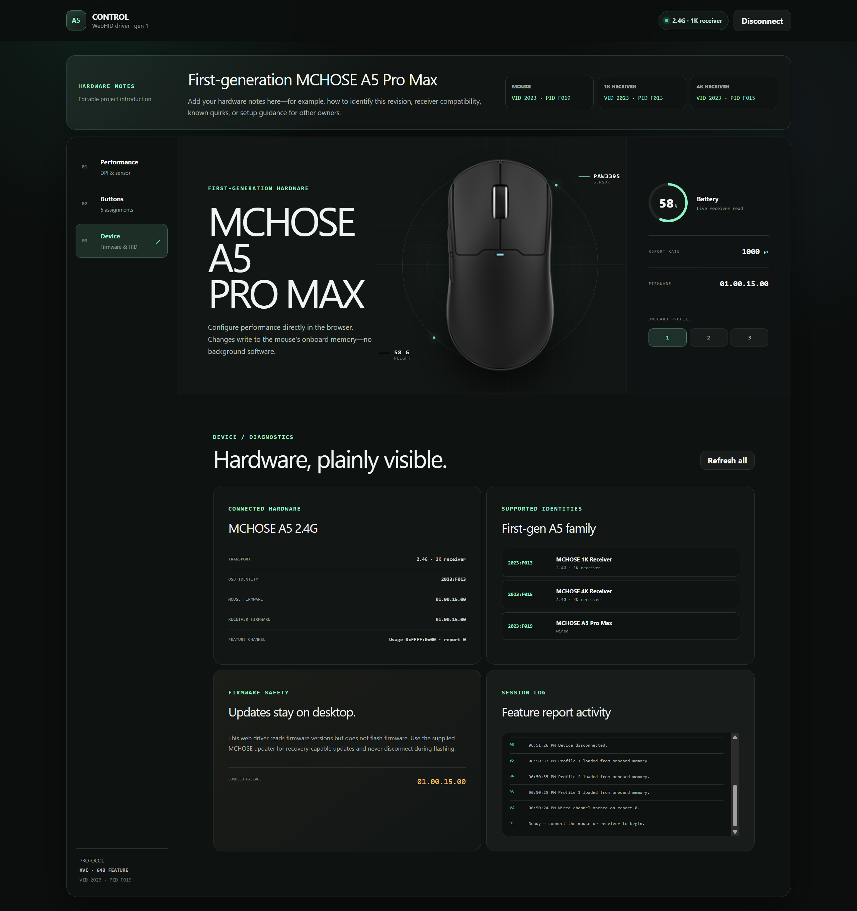
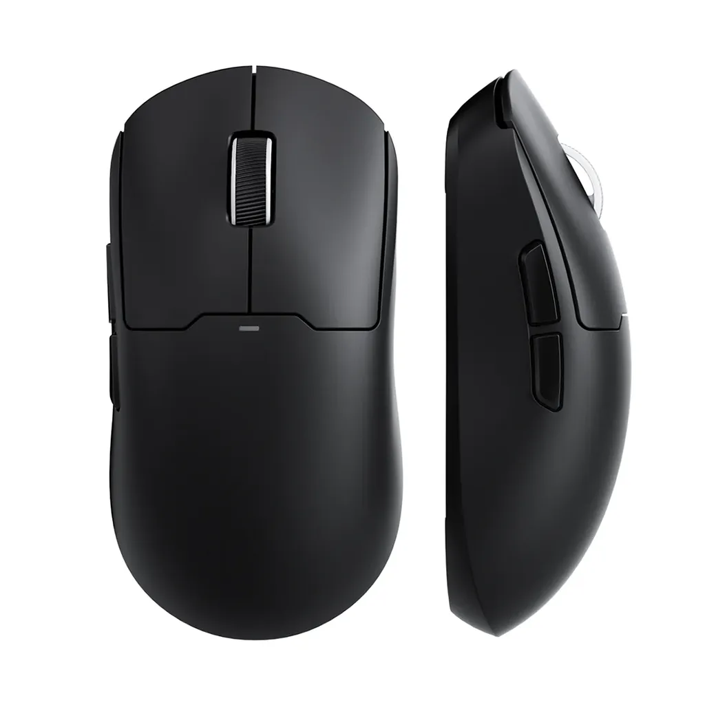
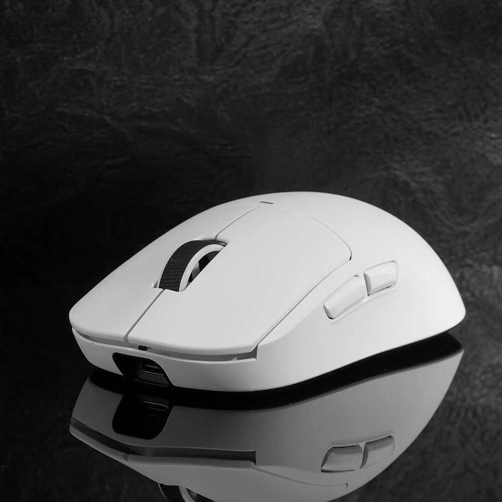
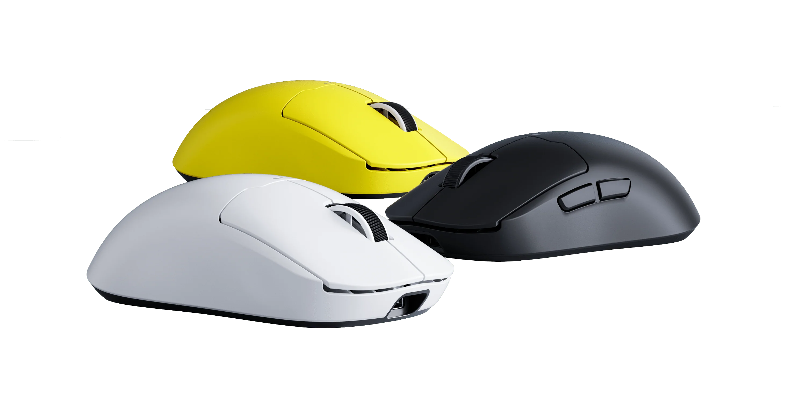

https://z750sasr.github.io/mchose-a5-pro-max-web-driver/

# An unofficial Web Driver for first generation, original MCHOSE A5 Pro Max

<table>
  <tr>
    <td rowspan="2" width="50%">
      
    </td>
    <td width="25%">
      
    </td>
    <td width="25%">
      
    </td>
  </tr>
  <tr>
    <td width="25%">
      
    </td>
    <td width="25%">
      
    </td>
  </tr>
</table>


## About This Project

This is a **web-based driver for the first-generation MCHOSE A5 Pro Max, released in 2023**.

I created this project primarily to prolong the useful life of the original A5 lineup. MCHOSE has effectively moved on from these models: information about the original A5 series has been removed from their current website, while newer mice have received web-driver support. The original A5, meanwhile, is still dependent on its older Windows desktop software.

That raised a fairly simple question:

**If newer MCHOSE mice can have a web driver, why can't the original A5?**

So I built one.

This project is also intended as a proof of concept. The original A5 hardware is perfectly capable of being controlled through a web application; the absence of an official web driver is not a fundamental technical limitation of the mouse.

For preservation purposes, this repository also contains a copy of the **latest desktop driver and firmware** available for the first-generation A5 Pro Max. This is useful in case the original downloads eventually become unavailable.

> [!NOTE]
> This project is **unofficial** and is not affiliated with or endorsed by MCHOSE.

## Support for Other Original A5 Variants

Adding support for other variants of the first-generation A5 lineup should be relatively straightforward.

The main limitation is hardware access.

I currently only own the **A5 Pro Max V1**, so this is the only model I can safely test and verify. Other A5 variants use their own desktop driver executables and firmware files, which means I need access to those files—and ideally the corresponding hardware—to determine their device-specific commands and confirm that everything works correctly.

If you own another original A5 variant and can provide its driver/firmware files or help test it, support for additional models can potentially be added.

## MCHOSE A5 Pro Max V1 (2023) Specifications

| Specification                     | Details                               |
| --------------------------------- | ------------------------------------- |
| **Controller**                    | Nordic nRF52840                       |
| **Polling Rate — Wired**          | 1000 Hz                               |
| **Polling Rate — 2.4 GHz**        | 1000 Hz with included receiver        |
| **Maximum Wireless Polling Rate** | 4000 Hz with optional 4K receiver     |
| **4K Receiver**                   | Not included; sold separately         |
| **Weight**                        | 59 g mouse + approximately 1 g dongle |
| **Battery**                       | 500 mAh                               |
| **Connectivity**                  | Wired / 2.4 GHz Wireless / Bluetooth  |
| **Switches**                      | Huano Blue Transparent Pink Dot       |

### Available Colors

* White, Black, Yellow, Berry Red

---

The goal of this repository is simple: **keep useful hardware useful instead of letting perfectly functional devices become obsolete because their software was left behind.**


This is a browser-only WebHID driver, it reads and writes the mouse's onboard settings directly from desktop Chrome or Edge, without installing a background driver or uploading device data.

> [!NOTE]
> Firefox and Safari do not currently support WebHID.

## Supported hardware

| Connection | USB identity | Notes |
| --- | --- | --- |
| Wired mouse | `2023:F019` | Direct USB connection |
| 1K receiver | `2023:F013` | 2.4 GHz receiver |
| 4K receiver | `2023:F015` | 2.4 GHz receiver |

The app selects the vendor configuration collection on usage page `FFFF` and communicates with 64-byte HID feature reports.

## Web Driver Features

- Three onboard profiles
- Up to six DPI stages, stage colors, and active-stage selection
- 125, 250, 500, and 1000 Hz report rates, subject to connection support
- Debounce, lift-off distance, sleep timer, Motion Sync, ripple control, and angle snapping
- Six button assignments with primary-click protection
- Battery, charging state, mouse firmware, and receiver firmware reads
- Automatic reconnection to a device that the browser has already approved

Firmware flashing is deliberately excluded. Use the supplied MCHOSE desktop updater for firmware and recovery operations.

## Edit the hardware information at the top

The introductory hardware block is intentionally separated from the interface code. Edit:

[`web-driver-app/lib/hardware-content.ts`](web-driver-app/lib/hardware-content.ts)

Change the title, description, or facts in `HARDWARE_INTRO`; the top section updates automatically. See [Hardware notes](docs/HARDWARE.md) for examples and guidance.

## Run locally

Requirements: Node.js 22.13 or newer and a current desktop version of Chrome or Edge.

```sh
cd web-driver-app
npm ci
npm run dev
```

Open the localhost address shown in the terminal. WebHID only works in a secure context: HTTPS or localhost.

## Deploy with GitHub Pages

The repository includes a static Vite build and a GitHub Actions workflow.

1. Push the repository to GitHub.
2. Open **Settings → Pages** in the repository.
3. Set **Source** to **GitHub Actions**.
4. Push to `main`, or run **Deploy WebHID driver to GitHub Pages** from the Actions tab.

The workflow builds `web-driver-app/github-dist` and publishes it. Repository subpaths and `username.github.io` repositories are both handled automatically. GitHub Pages supplies the HTTPS connection required by WebHID.

To test the same static build locally:

```sh
cd web-driver-app
npm run build:pages
npm run preview:pages
```

## Documentation

- [Hardware support and editable intro](docs/HARDWARE.md)
- [GitHub Pages and other deployment options](docs/DEPLOYMENT.md)
- [WebHID protocol notes](docs/PROTOCOL.md)
- [App-specific development notes](web-driver-app/README.md)

## Safety and privacy

- All HID traffic stays between the browser and the selected USB device.
- The browser requires an explicit device-selection gesture before granting access.
- The app writes only the settings exposed by the interface.
- Disconnecting during a settings write can leave that one setting unapplied; reconnect and read the device again.
- Firmware flashing remains in the vendor desktop updater because browser-based recovery is not provided.

This is an independent compatibility project and is not an official MCHOSE product.
